# FOSSEE Workshop Booking – UI/UX Enhancement

This project focuses on improving the UI/UX of the existing workshop booking platform using a **mobile-first approach**, better navigation, and a cleaner user experience.

---

## 🎯 Design Principles

- **Simplicity**  
  Streamlined the interface by reducing unnecessary visual elements and keeping only essential actions, making the UI cleaner and easier to use.

- **Clarity**  
  Improved the distinction between key actions like "Sign In" and "Register" to create a more intuitive and predictable user flow.

- **Visual Hierarchy**  
  Used spacing, font sizes, and layout to highlight important elements such as headings, forms, and buttons.

- **Consistency**  
  Maintained uniform styling across pages for a cohesive user experience.

- **Mobile-First Design**  
  Designed primarily for mobile users and then adapted for larger screens.

---

## 📱 Responsiveness

- Implemented a **single-column layout** for mobile screens  
- Added a **hamburger menu** to simplify navigation  
- Ensured **touch-friendly elements** (minimum 44px)  
- Used **media queries** to support multiple screen sizes  
- Optimized layout for both portrait and landscape modes  

---

## ⚖️ Design vs Performance Trade-offs

- Avoided heavy animations to maintain fast load times  
- Kept the UI minimal to reduce rendering complexity  
- Used simple components instead of large UI libraries  
- Focused on usability over visual complexity  

---

## 🧩 Challenges & Approach

**1. Navigation Clarity**  
- Improved the visibility and structure of navigation elements  
- Simplified user flow by reducing redundant actions  

**2. Routing Implementation**  
- Ensured proper page navigation using React Router  
- Created separate views for login and registration  

**3. Mobile Optimization**  
- Adapted layout for smaller screens using a mobile-first approach  
- Improved spacing and alignment for better readability  

---

## 📸 Visual Showcase

### 🔐 Authentication UI
<p align="center">
  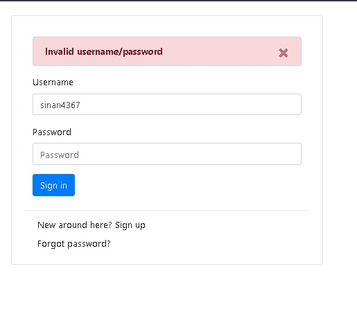
  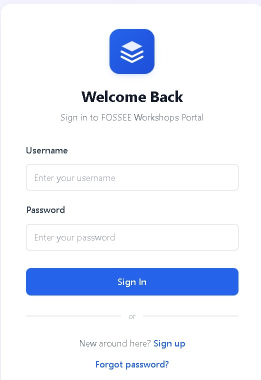
</p>
<p align="center"><i>Improved form layout, spacing, and readability</i></p>

---

### 🏠 Homepage
<p align="center">
  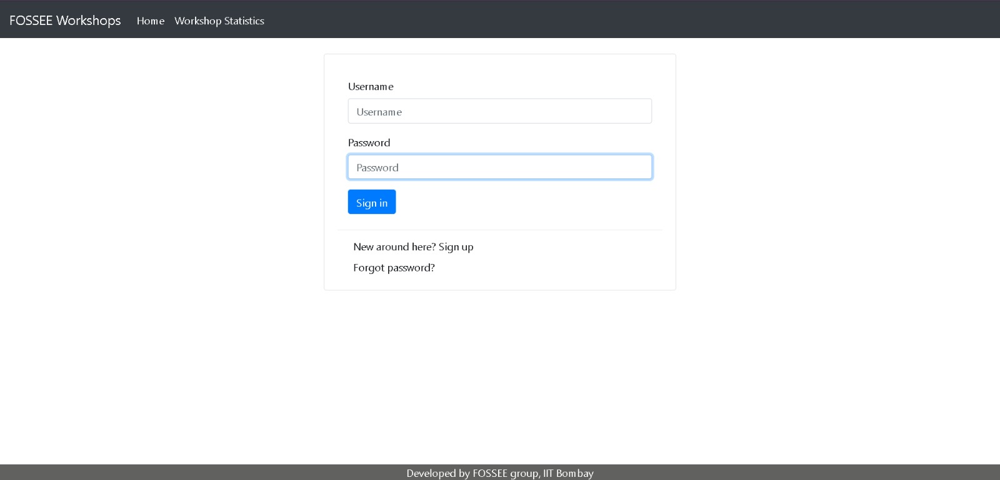
  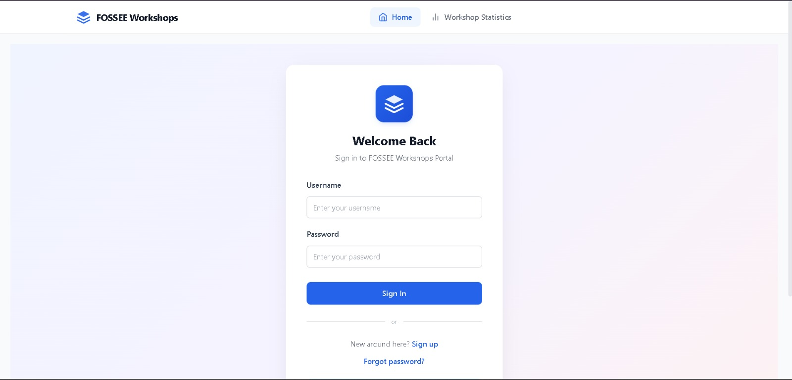
</p>
<p align="center"><i>Cleaner layout with better visual hierarchy</i></p>

---

### 📝 Registration Page
<p align="center">
  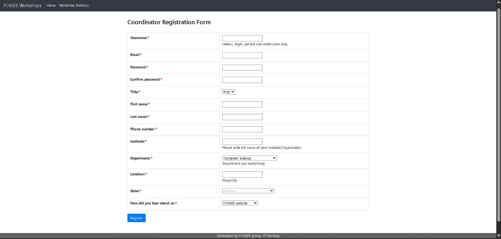
  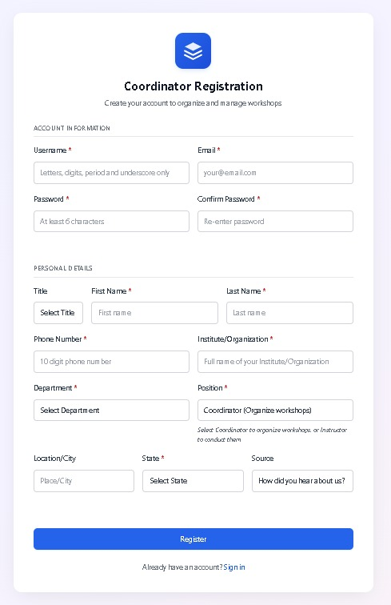
</p>
<p align="center"><i>Improved form structure and user flow</i></p>

---

### 📊 Workshop Statistics
<p align="center">
  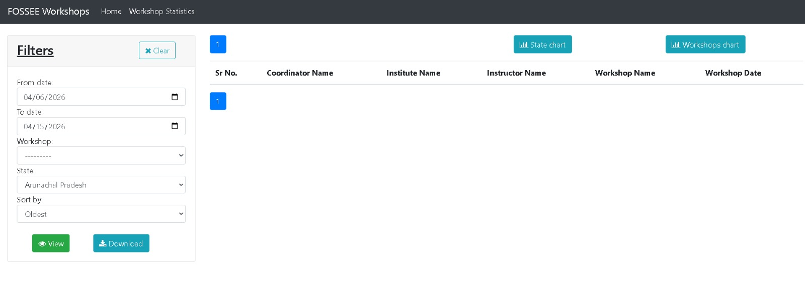
  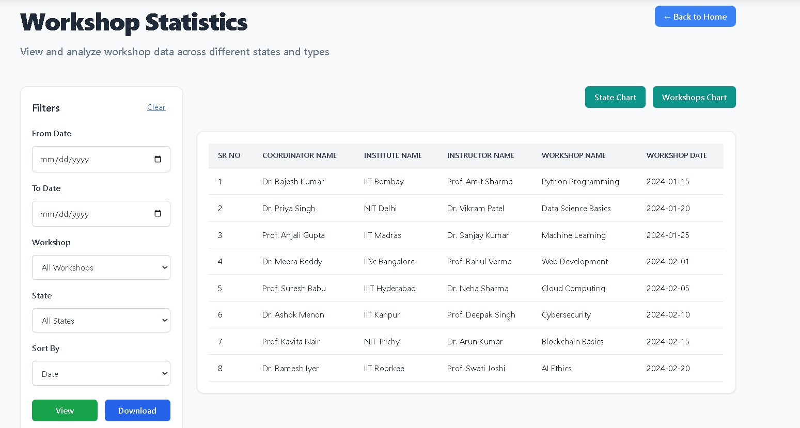
</p>
<p align="center"><i>Enhanced readability and layout organization</i></p>

---

### 📈 Charts UI
<p align="center">
  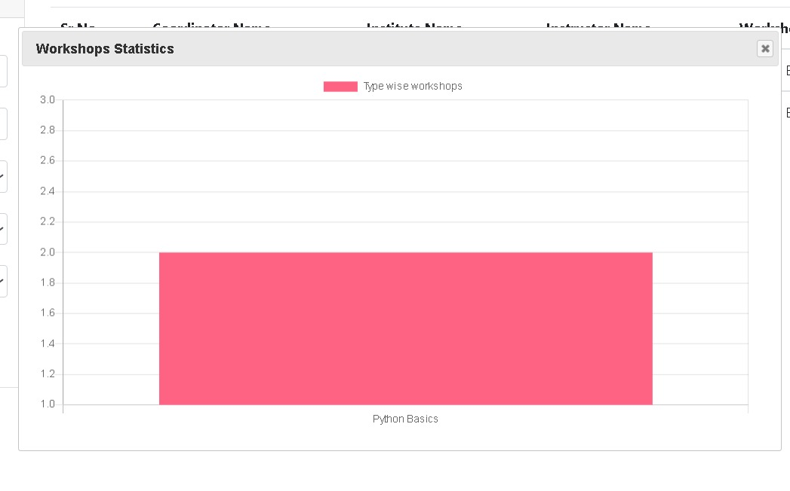
  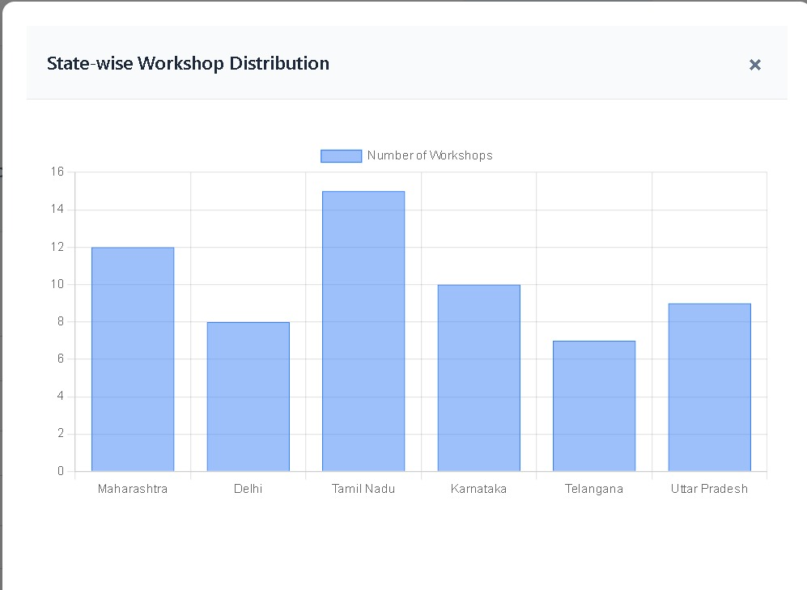
</p>
<p align="center"><i>Improved clarity and visual presentation of data</i></p>

---

### 🛠️ Propose Workshop
<p align="center">
  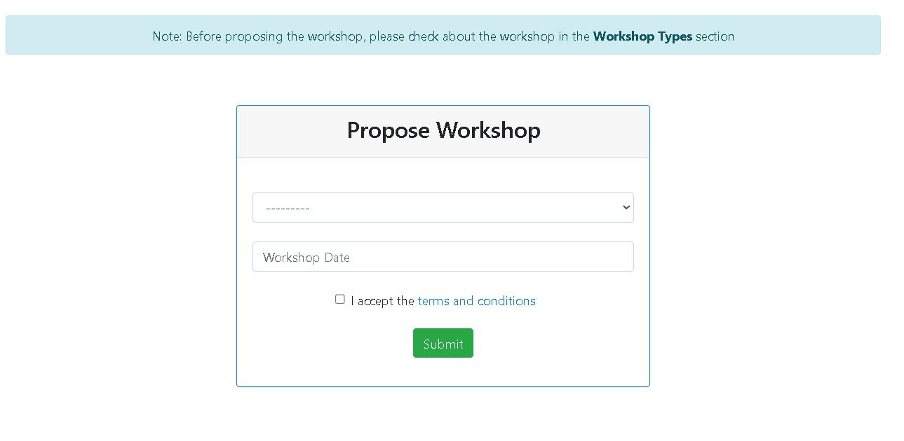
  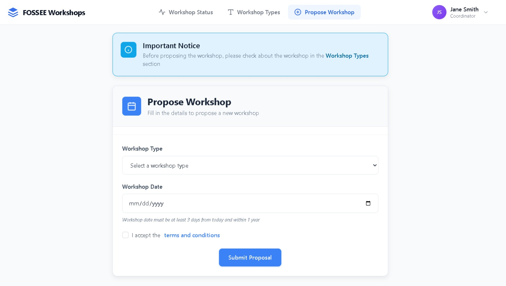
</p>
<p align="center"><i>Better form usability and structured layout</i></p>

---

### 📚 Workshop Types
<p align="center">
  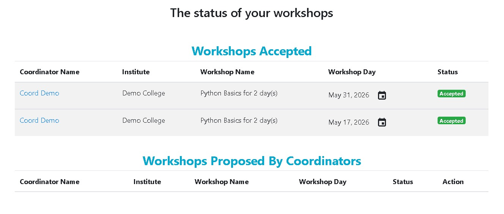
  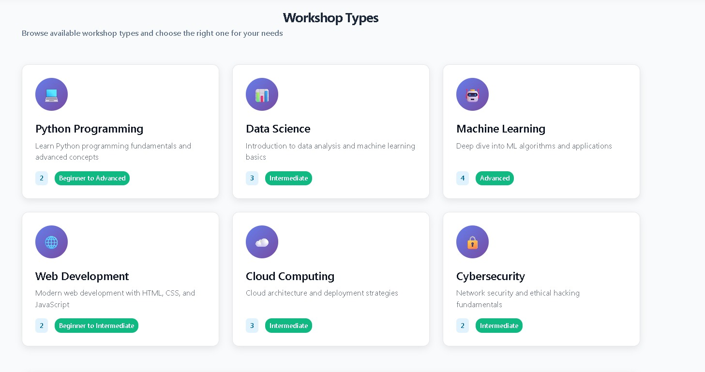
  
</p>
<p align="center"><i>Improved organization and cleaner UI</i></p>
## ⚙️ Setup Instructions

```bash
git clone <your-repo-link>
cd frontend
npm install
npm run dev
